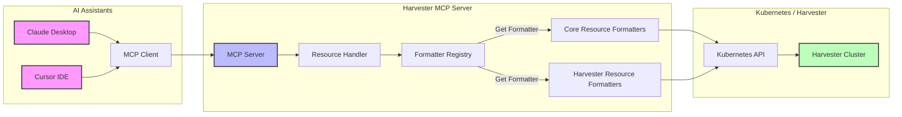

# Harvester MCP Server

Model Context Protocol (MCP) server for Harvester HCI that enables Claude Desktop, Cursor, and other AI assistants to interact with Harvester clusters through the MCP protocol.

## Overview

Harvester MCP Server is a Go implementation of the [Model Context Protocol (MCP)](https://spec.modelcontextprotocol.io/specification/2024-11-05/) specifically designed for [Harvester HCI](https://github.com/harvester/harvester). It allows AI assistants like Claude Desktop and Cursor to perform CRUD operations on Harvester clusters, which are essentially Kubernetes clusters with Harvester-specific CRDs.

## Workflow

The following diagram illustrates how Harvester MCP Server bridges the gap between AI assistants and Harvester clusters:



### How It Works

1. **LLM Integration**: AI assistants like Claude Desktop and Cursor connect to Harvester MCP Server via the MCP protocol.
2. **Request Processing**: The MCP Server receives natural language requests from the AI assistants and translates them into specific Kubernetes operations.
3. **Resource Handling**: The Resource Handler identifies the resource type and operation being requested.
4. **Formatter Selection**: The Formatter Registry selects the appropriate formatter for the resource type.
5. **API Interaction**: The server interacts with the Kubernetes API of the Harvester cluster.
6. **Response Formatting**: Results are formatted into human-readable text optimized for LLM consumption.
7. **User Presentation**: Formatted responses are returned to the AI assistant to present to the user.

This architecture enables AI assistants to interact with Harvester clusters through natural language, making complex Kubernetes operations more accessible to users.

## Features

- **Kubernetes Core Resources**:

  - Pods: List, Get, Delete
  - Deployments: List, Get
  - Services: List, Get
  - Namespaces: List, Get
  - Nodes: List, Get
  - Custom Resource Definitions (CRDs): List

- **Harvester-Specific Resources**:

  - Virtual Machines: List, Get
  - Images: List
  - Volumes: List
  - Networks: List

- **Enhanced User Experience**:
  - Human-readable formatted outputs for all resources
  - Automatic grouping of resources by namespace or status
  - Concise summaries with the most relevant information
  - Detailed views for comprehensive resource inspection

## Requirements

- Go 1.23+
- Access to a Harvester cluster with a valid kubeconfig

## Installation

### From Source

```bash
# Clone the repository
git clone https://github.com/starbops/harvester-mcp-server.git
cd harvester-mcp-server

# Build
make build

# Run
./bin/harvester-mcp-server
```

### Using Go Install

```bash
go install github.com/starbops/harvester-mcp-server/cmd/harvester-mcp-server@latest
```

## Configuration

The server automatically looks for Kubernetes configuration in the following order:

1. In-cluster configuration (if running inside a Kubernetes cluster)
2. Path specified by the `--kubeconfig` flag
3. Path specified by the `KUBECONFIG` environment variable
4. Default location at `~/.kube/config`

### Command-Line Flags

```
Usage:
  harvester-mcp-server [flags]

Flags:
  -h, --help                help for harvester-mcp-server
      --kubeconfig string   Path to the kubeconfig file (default is $KUBECONFIG or $HOME/.kube/config)
      --log-level string    Log level (debug, info, warn, error, fatal, panic) (default "info")
```

### Examples

Using a specific kubeconfig file:

```bash
harvester-mcp-server --kubeconfig=/path/to/kubeconfig.yaml
```

Using the KUBECONFIG environment variable:

```bash
export KUBECONFIG=$HOME/config.yaml
harvester-mcp-server
```

With debug logging:
```bash
harvester-mcp-server --log-level=debug
```

## Usage with Claude Desktop

1. Install Claude Desktop
2. Open Claude Desktop configuration file (`~/Library/Application\ Support/Claude/claude_desktop_config.json` or similar)
3. Add the Harvester MCP server to the `mcpServers` section:

```json
{
  "mcpServers": {
    "harvester": {
      "command": "/path/to/harvester-mcp-server",
      "args": ["--kubeconfig", "/path/to/kubeconfig.yaml", "--log-level", "info"]
    }
  }
}
```

4. Restart Claude Desktop
5. The Harvester MCP tools should now be available to Claude

## Example Queries for Claude Desktop

Once your Harvester MCP server is configured in Claude Desktop, you can ask questions like:

- "How many nodes are in my Harvester cluster?"
- "List all pods in the cattle-system namespace"
- "Show me the details of the pod named rancher-789c976c6-xbvmd in cattle-system namespace"
- "List all virtual machines in the default namespace"
- "What services are running in the harvester-system namespace?"

## Development

### Project Structure

- `cmd/harvester-mcp-server`: Main application entry point
- `pkg/client`: Kubernetes client implementation
- `pkg/cmd`: CLI commands implementation using Cobra
- `pkg/mcp`: MCP server implementation
- `pkg/kubernetes`: Unified resource handlers for Kubernetes resources
- `pkg/tools`: Legacy tool implementations for interacting with Harvester resources

### Resource Handling

The project uses a unified approach to handle Kubernetes resources:

1. The `pkg/kubernetes/resources.go` file contains a `ResourceHandler` that provides common operations for all resource types:
   - Listing resources with proper namespace handling
   - Getting resource details by name
   - Creating and updating resources
   - Deleting resources

2. The `pkg/kubernetes/formatters*.go` files contain formatters for different resource types:
   - Each formatter converts raw Kubernetes objects into human-readable text
   - Resource-specific details are extracted and formatted in a consistent way
   - Custom formatters exist for both standard Kubernetes resources and Harvester-specific resources

3. The `pkg/kubernetes/types.go` file maps friendly resource type names to Kubernetes GroupVersionResource objects:
   - Makes it easy to refer to resources by simple names in code
   - Centralizes resource type definitions

### Adding New Tools

To add a new tool:

1. If it's a new resource type, add it to `pkg/kubernetes/types.go`
2. Implement formatters for the resource in one of the formatter files
3. Register the tool in `pkg/mcp/server.go` in the `registerTools` method using the unified resource handler

### Formatting Functions

Each resource type has two formatting functions:
1. `formatXList` - Formats a list of resources with concise information, grouped by namespace
2. `formatX` - Formats a single resource with detailed information

## License

This project is licensed under the Apache License 2.0 - see the [LICENSE](LICENSE) file for details.

## Acknowledgments

- [Harvester HCI](https://github.com/harvester/harvester) - The foundation for this project
- [mark3labs/mcp-go](https://github.com/mark3labs/mcp-go) - The Go SDK for Model Context Protocol
- [manusa/kubernetes-mcp-server](https://github.com/manusa/kubernetes-mcp-server) - Reference implementation for Kubernetes MCP server